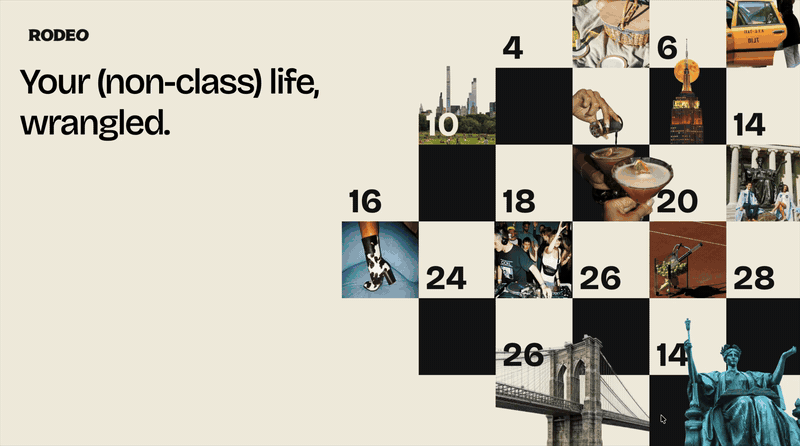

# rodeo-columbia-branding

Branding drafts and landing page for **RODEO** — your (non-class) life, wrangled.

## Demo



[Full-quality recording (MP4)](demo/flier-storm.mp4)

## Landing page

`index.html` is the landing page — a Claude Design canvas export (runs via
`support.js`) of the flier-storm concept. Flier art lives in `fliers/`, photography in
`photos/`, and shared brand assets in `assets/`.

```bash
open index.html
```

Design source: Figma `rodeo-branding-draft` + the Claude Design project `Rodeo Columbia Branding`.
